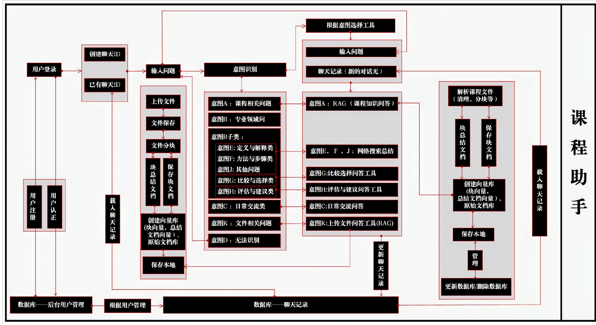

# AI engineer mentor

## 概述
产品文档：AI engineer mentor
课程助手是一款旨在帮助用户解决与课程相关问题的智能工具。它不仅能够处理课程知识问答（RAG），还能进行日常交流、文件上传与解析，以及提供专业领域的比较选择和评估建议等服务。本产品文档将详细介绍课程助手的功能结构及其工作流程。

## 用户使用流程
1.用户提出问题或指令
2.系统进行意图识别
3.系统选择合适的工具进行处理

## 相关主页面

**课程助手主页**
    1.本页面主要提供课程助手的核心功能，包括课程相关问题回答、日常交流、文件上传与解析、网络搜索和专业领域问答等
    2.页面元素有：
        1.问题输入框，用户可以在此输入问题或指令
        2.发送按钮，点击后系统开始处理用户输入
        3.聊天记录展示区域，显示用户与系统的对话记录

## 功能详细描述

### 意图识别模块
    本模块的作用识别用户输入的问题或指令的意图类型，以便系统选择合适的工具进行处理
    课程相关问题回答功能
        功能描述：通过RAG技术回答关于课程内容的具体问题
        使用步骤：用户在问题输入框中输入课程相关问题，点击发送按钮
        功能点：
        RAG技术：根据预设的课程知识库，系统能够回答用户关于课程内容的具体问题
        异常情况及处理：如果用户提出的问题不在课程知识库中，系统会提示用户进行网络搜索
        涉及字段：问题输入框

### 日常交流功能
    功能描述：支持用户之间的日常对话和交流
    使用步骤：用户在问题输入框中输入对话内容，点击发送按钮
    功能点：
    对话记录：系统会将用户与系统的对话记录保存并展示在聊天记录示区域
    涉及字段：问题输入框

### 文件相关问题功能
    功能描述：允许用户上传文件，并对这些文件进行保存、解析等操作
    使用步骤：用户点击文件上传按钮，选择要上传的文件，点击发送按钮
    功能点：
        文件上传：用户可以选择要上传的文件，并将其发送给系统
        文件保存：系统会将用户上传的文件保存在后台数据库中
        文件解析：系统可以对上传的文件进行解析，提取其中的信息并展示给用户

### 网络搜索功能
    功能描述：对于不属于预设知识库的问题，提供网络搜索的能力
    使用步骤：用户在问题输入框中输入问题，点击发送按钮
    功能点：
        网络搜索：系统会根据用户输入的问题进行网络搜索，并将搜索结果展示给用户
        异常情况及处理：无
        涉及字段：问题输入框

### 专业领域问答功能
    功能描述：包括定义与解释、方法与步骤比较与选择、评估与建议等子类别的专业领域问答
    使用步骤：用户在问题输入框中输入问题，点击发送按钮
    功能点：
        专业领域问答：系统可以回答用户关于专业领域的问题，包括定义与解释、方法与步骤、比较与选择、评估与建议等
        异常情况及处理：无
        涉及字段：问题输入框

### 用户管理模块
    本模块的作用是管理用户的注册、认证和聊天记录等信息
    用户注册与认证功能
    功能描述：确保每个用户的个人信息安全及权限管理
    使用步骤：用户在注册页面填写个人信息，点击注册按钮进行注册
    功能点：
        用户注册：用户可以填写个人信息进行注册
        用户认证：系统会对用户进行认证确保用户的个人信息安全
        异常情况及处理：无
        涉及字段：注册页面的个人信息字段

### 聊天记录管理功能
    功能描述：支持根据聊天ID更新和加载聊天记录，为用户提供连续的服务体验
    使用步骤：用户在聊天记录页面选择要更新或加载的聊天ID，点击更新或加载按钮
    功能点：
        聊天记录更新：可以选择要更新的聊天ID，系统会更新该聊天ID的聊天记录
        聊天记录加载：用户可以选择要加载的聊天ID，系统会加载该聊天ID的聊天记录

## 系统维护模块

### 系统健康监控功能
    功能描述：本功能用于实时监控系统的运行状态，确保系统的稳定性和高效性。
    使用步骤：系统管理员定期查看健康监控面板，检测系统性能指标。
    功能点：
        资源监控：监控CPU、内存、磁盘等系统资源的使用情况，确保系统运行正常。
        错误日志记录：系统会自动记录运行中的错误日志，供技术支持人员分析问题。
        告警系统：当系统出现异常时，自动发送告警通知给管理员。
    异常情况及处理：
        如果出现系统崩溃或重大错误，系统会通过邮件或消息通知管理员，并自动进行部分恢复操作。
        涉及字段：监控面板、错误日志、告警通知

### 系统版本管理功能
    功能描述：确保系统的每个版本都有清晰的记录，并能快速回滚至稳定版本。
    使用步骤：管理员可以查看当前系统版本信息，执行版本升级或回滚操作。
    功能点：
        版本升级：管理员可以在系统面板选择安装新的系统版本，进行升级操作。
        版本回滚：如果当前版本出现问题，可以选择回滚到历史稳定版本。
    异常情况及处理：
        在版本升级或回滚过程中，若出现系统不可用的情况，系统会自动恢复到上一个稳定版本。
        涉及字段：版本信息、回滚按钮、升级按钮

### 数据备份与恢复功能
    功能描述：定期对系统数据进行备份，以防止数据丢失，并能够在必要时恢复数据。
    使用步骤：管理员定期设置备份周期，并可以手动进行备份与恢复操作。
    功能点：
        定期备份：系统会定期对数据进行备份，确保数据的安全性。
        手动备份与恢复：管理员可以手动执行备份或恢复操作，确保数据的可恢复性。
    异常情况及处理：
        如果备份失败，系统会自动重新尝试备份，并通知管理员。
        数据恢复过程中若出现问题，系统会回滚至上次成功备份的状态。
    涉及字段：备份设置、恢复按钮

## 知识库维护模块

### 知识库内容更新功能
    功能描述：本功能用于定期更新课程知识库中的内容，确保用户能够获取到最新的课程资料和信息。
    使用步骤：管理员可以手动或自动进行知识库更新，增加新的课程内容或修改已有内容。
    功能点：
        内容添加：管理员可以通过上传文件或手动输入的方式增加新的知识库条目。
        内容修改：管理员可以对已有的课程内容进行修改，确保知识库始终保持最新状态。
        内容删除：不再需要的课程内容可以被删除，确保知识库的简洁性。
    异常情况及处理：
        如果内容更新失败，系统会提示管理员，并提供恢复操作的选项。
        若删除的内容被误删，管理员可以通过备份数据恢复。
    涉及字段：知识库管理面板、内容编辑器、删除按钮

### 知识库质量审查功能
    功能描述：通过审核机制确保知识库中的内容质量，避免出现错误或不准确的信息。
    使用步骤：管理员可以设定审查流程，指定审核人员对新增或修改的内容进行审核。
    功能点：
        内容审核：新增或修改的知识库内容需要经过指定审核人员的检查与确认。
        质量评估：系统可以根据用户反馈和内容的访问量自动评估内容质量，提醒管理员进行调整。
    异常情况及处理：
        如果审核人员未通过审核，系统会要求对内容进行修改，并提示需要改进的地方。
        若质量评估发现问题，管理员会收到通知，并可以根据建议调整内容。
    涉及字段：审核面板、内容评估、反馈提醒

### 知识库访问权限管理功能
    功能描述：为确保知识库内容的安全性和私密性，管理员可以设定不同级别的访问权限。
    使用步骤：管理员根据不同角色为用户分配访问权限，决定其对知识库的访问范围。
    功能点：
        角色管理：可以设置不同角色的用户，例如管理员、审核员、普通用户等，分别拥有不同的权限。
        权限控制：管理员可以对不同的知识库内容设置不同的访问权限，确保敏感信息的安全。
    异常情况及处理：
        若权限设置错误，用户会提示权限不足，管理员可调整权限设置。
    涉及字段：权限管理面板、角色设置、访问控制

## 后续问题猜测模块
功能描述
后续问题猜测模块通过分析当前用户提问的内容、历史对话及上下文信息，智能推测用户接下来可能会提出的相关问题。系统不仅会猜测后续问题，还会主动为用户提供一个可选择的后续问题列表，以提高对话的流畅性和效率。

### 使用步骤
    1.用户输入问题：用户向系统输入一个问题或指令，系统通过意图识别模块识别该问题的核心意图。
    2.历史对话分析：系统会分析当前问题与历史对话内容之间的关系，捕捉到用户的潜在需求和可能的后续问题。
    3.推测后续问题：系统会根据问题的类型、上下文内容和用户的提问模式推测用户接下来可能会问的问题。
    4.提供后续问题选择：系统在聊天记录区域或专门的提示框中展示多个可能的后续问题供用户选择，用户可以直接选择其中之一继续提问，或者自由输入新问题。

### 功能点
    智能后续问题推测：基于当前对话内容、历史对话记录以及语境，系统会推测用户可能的后续问题。
    后续问题选择列表：系统展示一个下拉式或卡片式的后续问题选择列表，用户可以点击选项快速继续对话。
    例如，如果用户询问“如何进行课程学习规划？”，系统可能会推测出“如何制定学习目标？”、“有哪些学习工具可以辅助？”等后续问题，用户可以直接选择。
    个性化推荐：系统会根据用户的历史互动和个性化需求调整后续问题的推荐，确保推荐的问题符合用户的实际需求。
    上下文智能优化：通过上下文信息，系统会优先推荐与当前对话最相关、最有可能被提问的后续问题，以减少无关问题的干扰。

### 异常情况及处理
    无法推测后续问题：如果系统无法推测出合理的后续问题，系统会留空提示或展示“未能预测后续问题，您可以直接输入问题”。
    猜测问题不符合用户需求：如果用户选择的后续问题不符合预期，系统会提示用户可以输入新的问题或查询，并根据用户输入的信息重新推测。
    用户没有选择后续问题：即使系统推荐了后续问题列表，用户依然可以选择继续输入自己想要的任何问题，系统将自动重新识别并处理。

### 涉及字段
    问题输入框：用户输入问题的地方，用户可以选择从后续问题列表中选择问题或自行输入。
    后续问题推测引擎：后台引擎根据历史对话、上下文信息以及用户行为分析，推测并生成相关的后续问题。
    后续问题选择列表：显示推测后的相关问题供用户选择，可以是卡片形式、按钮列表或弹出窗口。
    聊天记录展示区域：显示6当前的对话记录，以及后续问题选择列表，用户可以点击进行选择或继续输入。

### 示例场景
    场景一：用户提问“如何学习机器学习？”系统推测出可能的后续问题，如“机器学习的入门书籍有哪些？”、“机器学习的学习路径是什么？”、“有什么在线学习资源？”等，并展示这些问题作为可选择项，供用户快速选择。
    场景二：用户询问“什么是深度学习？”系统根据上下文和历史问题，推测出“深度学习和机器学习的区别”或“深度学习的常见算法”等问题，并主动展示在后续问题选择区域。
